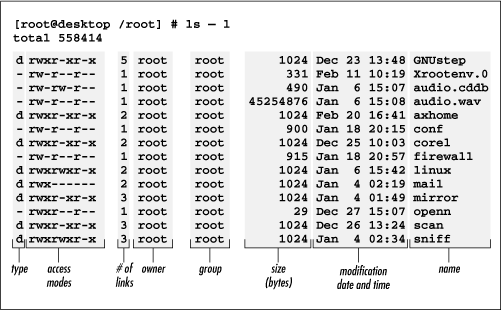

### Создать файлы и директории с требуемым названием;
### Задать им требуемые из скриншота свойства и размер в байтах:

```
$> ls -l  
total 42  
drwx--xr-x  2 XX  XX  XX Jun  1 20:47 test0  
-rwx--xr--  1 XX  XX   4 Jun  1 21:46 test1  
dr-x---r--  2 XX  XX  XX Jun  1 22:45 test2  
-r-----r--  2 XX  XX   1 Jun  1 23:44 test3  
-rw-r----x  1 XX  XX   2 Jun  1 23:43 test4  
-r-----r--  2 XX  XX   1 Jun  1 23:44 test5  
lrwxr-xr-x  1 XX  XX   5 Jun  1 22:20 test6 -> test0  
$>  
```



mkdir ex02  
cd ex02  
mkdir test0  
mkdir test2  
touch test1  
touch test3  
touch test4  
+++ touch test{1,3,4} можно было так создать  
++ жесткую ссылку test5 на test3  
ln test3 test5  
++ символьную ссылку с названием test6 на директорию test0  
ln -s test0 test6  
ls -l  
echo "111" >test1  
echo "" >test3  
echo "1" >test4  
ls -l  
touch -t 202106012047 test0  
touch -t 202106012146 test1  
touch -t 202106012245 test2  
touch -t 202106012344 test3  
touch -t 202106012343 test4  
~~touch -t 202106012344 test5~~  
touch -h -t 202106012220 test6  
ls -l  
chmod 715 test0  
chmod 714 test1  
chmod 504 test2  
chmod 404 test3  
chmod 641 test4  
chmod 755 test6  
ls -l  
tar -cf exo2.tar *  
cd ..  


--------  
Проверка:  
cd ex02  
tar -xvf exo2.tar  
ls -l  

For more info:  
man touch  
man chmod